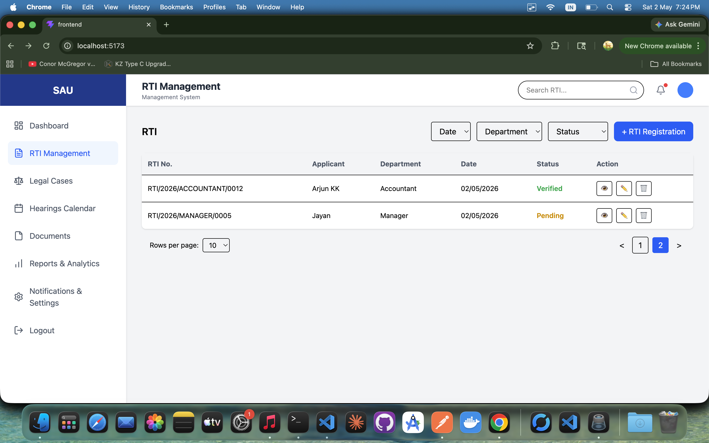

# RTI Management Dashboard

A full-stack RTI (Right to Information) management system with pagination, filtering, status updates, and document handling.


## 🚀 Features

- 📄 RTI Listing with Pagination
- 🔍 Filter by Date, Department, Status
- ➕ Create New RTI
- ✏️ Edit RTI Details
- 🗑️ Delete RTI with Confirmation
- 🔄 Inline Status Update (Optimistic UI)
- 📁 File Upload Support
- ⚡ Toast Notifications


## 🛠️ Tech Stack

**Frontend:**
- React (Vite)
- Tailwind CSS
- React Hook Form
- React Hot Toast

**Backend:**
- Node.js
- MongoDB
- Zod Validation


## 📸 Screenshots

### RTI List Page


### Create RTI


 

 


## 🎥 Demo Videos

- RTI Dashboard Overview  
  https://youtu.be/8AdD8h079Wg

-  RTI Flow  
https://youtu.be/lIMRpqVSvFM


<iframe width="560" height="315" src="https://www.youtube.com/embed/8AdD8h079Wg?si=pi3gqRbdGY_grh0F" title="YouTube video player" frameborder="0" allow="accelerometer; autoplay; clipboard-write; encrypted-media; gyroscope; picture-in-picture; web-share" referrerpolicy="strict-origin-when-cross-origin" allowfullscreen></iframe>


## ⚙️ Installation

### Clone the repo
```bash
git clone https://github.com/your-username/rti-dashboard.git
cd sau-rti-managment

cd frontend
npm install
npm run dev

cd backend
npm install
npm run dev


---

## 7. 🔗 API Overview

Keep it simple (don’t overdo it):

```md
## 🔗 API Endpoints

- GET /rtis/:id → Get singel SiRTI
- GET /rtis → Get paginated RTIs
- POST /rtis → Create RTI
- DELETE /rtis/:id → Delete RTI
- PUT /rtis/:id/status → Update status


## ✨ Highlights

- Optimistic UI updates for delete & status change
- Clean separation of concerns using custom hooks
- Reusable form components
- Efficient pagination & filtering
- Backend-driven RTI number generation  